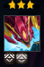

## 👋 Hi, I'm Alan Yong

I'm a third-year Computer Science student passionate about building tools, games, and automation scripts that solve real problems. Below is a curated overview of my most notable projects, with links to full write-ups and source code.

&nbsp;
## Featured Projects
### [(2021) TFT Matchup Predictor](https://github.com/alanyongy/tft-matchup-predictor)

Real-time overlay tool for predicting upcoming opponents in *Teamfight Tactics*, using only screen data and a custom-built OCR system.

🔧 **Tech:** AutoHotkey (AHK)  

✨ **Notable Features:**  
- Custom OCR using AHK’s `ImageSearch` to identify player names across two UI elements  
- Real-time overlay showing which opponents can appear next, adapting to matchmaking rules and dynamic lobbies  
- Screen region calibration using static UI anchors for reliable detection  
- Functional in high-ranked competitive matches, where accuracy and timing were critical  

--Insert Visuals--

💡 *Used in competitive play before Riot Games implemented this feature natively — matched their logic exactly.*

### [*🔗 Full write-up*](https://github.com/alanyongy/tft-matchup-predictor)

  
&nbsp;
### [(2025) AEGIS Multi-Agent Rescue AI](https://github.com/yourusername/aegis-rescue-ai)

A Python AI for the AEGIS multi-agent simulation that coordinates multiple rescue robots under messaging delays to save survivors in minimal turns.

**Tech:** Python, AEGIS API

✨ **Notable Features:**  
- **Simulation-Based Coordination:** Each agent locally simulates *every* agent’s upcoming moves per turn, effectively creating “instant” shared memory and bypassing the 1-turn message delay.  
- **Distributed Systems Insight:** Overcame communication constraints to keep agents perfectly synchronized without extra messaging.  
- **Team Leadership:** Championed and implemented the core simulation strategy, guiding the team’s design and integration.

--Insert Visuals--

💡 Achieved significantly higher scores (fewer moves used) than peers across varied test worlds, resulting in 100% assignment score.

### [*🔗 Full write-up*](https://github.com/yourusername/link)  
  
&nbsp;
### [(2025-Present) Unity Multi-Unit Selection & Formation System](https://github.com/alanyongy/game-systems-showcase)

> ⚠️ **Work in Progress:** Full technical writeup and examples will be added soon.

A technical case study showcasing real-time multi-unit selection and movement in Unity, alongside a formation system for coordinating unit positioning.  
This repository focuses on these systems, which were originally built as part of a larger game but are presented here independently.

**Tech:** C#, Unity  

✨ **Notable Features:**  
- **Real-time Multi-unit Control:** Implemented intuitive multi-unit selection and movement with click, drag, and continuous target updates for up to four units simultaneously. Includes smooth input handling and deselection mechanics.  
- **Formation System:** Dynamic formation logic to coordinate units based on player-selected targets and desired positioning, demonstrating scalable group movement in an RTS-style setup.

--Insert Visuals--  

💡 Demonstrates core gameplay programming and software engineering skills in input handling, group movement, and system architecture, as well as identifying challenges in multi-unit control and designing and implementing effective, scalable solutions for coordinated movement. 

### [*🔗 Full write-up*](https://github.com/alanyongy/game-systems-showcase)
> 📚 *Technical writeup under construction — will detail formation algorithms and multi-unit input handling.*

&nbsp;
### Other Projects
> 

>   
Click to expand

>
> ### [(2020) LoL Kha’Zix Item DPS Calculator](https://github.com/yourusername/r-simulator)
> 
> Interactive spreadsheet tool for comparing item builds and DPS outcomes on the champion Kha’Zix in League Of Legends, factoring in in-game variables like level, skill combo, armor, and existing items. 
> 
> **🔧 Tech:**  
> Google Sheets (Scriptless)
> 
> **✨ Notable Features:**  
> - Dynamic checkbox-and dropdown-based UI for skill selection, level, item choices, and enemy stats  
> - Calculates marginal benefit of new items based on current build (e.g. "How much does this item improve my damage if I already own X and Y?")  
> - Graph compares relative damage increases over time between multiple selected items 
> - Fully formula-driven: uses hundreds of excel-formulas (ie. `IF`, `VLOOKUP`), and reference tabs to model game logic  
> - No scripts used — all logic embedded in spreadsheet cells with google sheets excel-style formulas
> 
> --Insert Visuals--  
> - GIFs and screenshots available (tool in use + formula breakdowns)  
> - [YouTube tutorial video](#) explaining usage and showcasing features  
> - [Reddit post](#) sharing the tool with the community
> 
> 💡 Used personally and by others to optimize high-level Kha’Zix item builds by quantifying damage tradeoffs. 
>
> [*🔗 Full write-up*](https://github.com/yourusername/link)  
>
> &nbsp;
> ### [(2023) HSR Jingliu/Bronya Turn-Order Simulator](https://github.com/yourusername/hsr-simulator)
> A console-based Java tool that models turn order and damage trade-offs for two characters in Honkai Star Rail, then brute-forces every speed-vs-damage combination to find optimal setups.
> 
> **🔧 Tech:** Java  
>
> **✨ Notable Features:**  
> - **Simulation Engine:** Accurately tracks state changes (energy, buffs, strong/weak phases, out-of-turn ults).  
> - **Parameter Search:** Divides speed ranges into user-defined brackets and finds the highest DPS combinations in each.  
> 
> --Insert Visuals--
> *Include a GIF or screenshot of console output for one bracket and the corresponding performance graph.*
>
> 💡 Confirmed community-recommended speed strategy with independent simulation.
>
> [*🔗 Full write-up*](https://github.com/yourusername/link)  
> 

&nbsp;
## Final Thoughts
These projects span many years of my journey in software development and primarily reflect my focus on solving real problems. Earlier work prioritized function and rapid iteration, often built for immediate personal use. More recent projects emphasize structure, readability, and maintainability — driven by larger project scopes (eg. full game development in Unity) and collaborative or academic settings where such qualities are essential.
&nbsp;

## Résumé & Contact

- 📄 [View My Résumé](CS-Resume.pdf)
- 🔗 [LinkedIn](https://www.linkedin.com/in/alan-yong-abb154395/)
- 📫 Email: alanyongy@gmail.com

