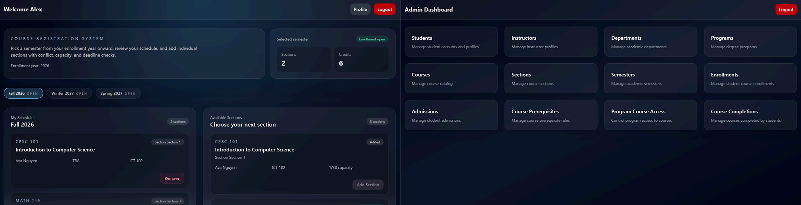
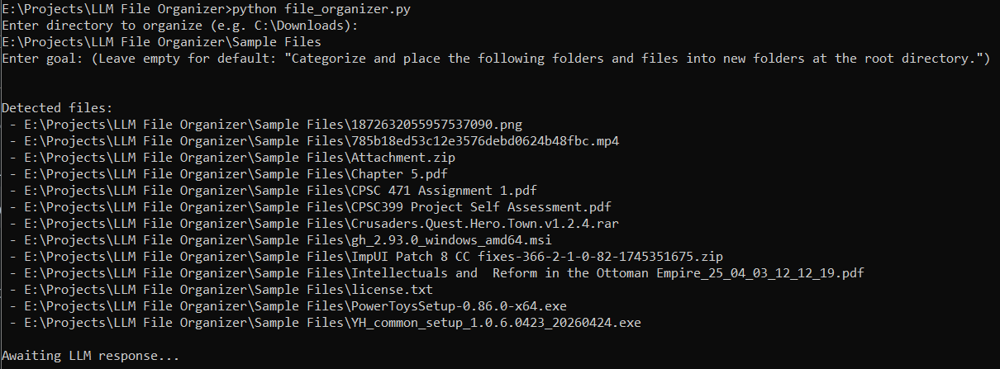
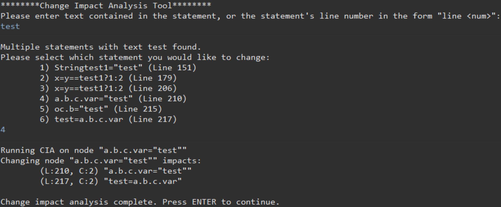
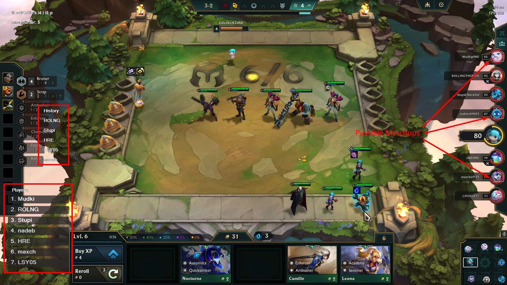

## 👋 Hi, I'm Alan Yong

I build software systems involving  full-stack applications, static analysis, distributed coordination, automation, and real-time control, from compiler-style tooling and full-stack applications to OCR pipelines and multi-agent AI algorithms.

## Featured Projects
### [(2026) Full Stack Student Enrollment System](https://github.com/alanyongy/student-enrollment-system)

A full-stack course registration platform supporting student enrollment workflows and administrative management of courses, departments, and student records.

**🔧 Tech:** Java, Spring Boot, MySQL, React  

✨ **Notable Features:**  
- Developed backend APIs and relational database workflows for course enrollment and academic record management  
- Supports role-based workflows for both students and administrators  
- Implements enrollment, drop, and course-offering management with database-backed validation logic  
- Designed relational schemas for departments, courses, students, admissions, and enrollments  
- Integrated frontend and backend systems into a unified web application with persistent database storage  

💡 Demonstrates practical software engineering skills in full-stack development, database design, backend architecture, and multi-user workflow systems.

### [*🔗 Full write-up*](https://github.com/alanyongy/student-enrollment-system)

&nbsp;
---

### [(2026) Safe LLM File Organizer](https://github.com/alanyongy/safe-llm-file-organizer)

A safety-first AI-powered file organization system that converts natural language goals into structured filesystem operations using an LLM planning layer with deterministic validation and execution guards.

**🔧 Tech:** Python, OpenAI API, JSON

✨ **Notable Features:**
- Natural language file organization through an LLM planning layer that converts user goals into structured execution plans
- Designed a constrained AI agent architecture separating planning, validation, and execution into independent components
- Implemented deterministic validation guardrails including action whitelisting, path safety checks, root-directory sandboxing, and plan size limits
- Built a restricted execution engine exposing only approved filesystem operations, preventing arbitrary code execution
- Human-in-the-loop workflow requiring plan review and approval before any filesystem modifications occur
- Collision-safe file movement with automatic renaming and folder creation to prevent accidental data loss

💡 Demonstrates practical AI agent engineering through secure tool use, defense-in-depth validation, sandboxed execution, and the separation of probabilistic AI planning from trusted system actions.

### [*🔗 Full write-up*](https://github.com/alanyongy/safe-llm-file-organizer)

&nbsp;
---

### [(2026) Java Change Impact Analyzer](https://github.com/alanyongy/java-change-impact)

A static analysis tool that parses Java source code and predicts which lines and methods may be affected by a change to a specified line of code.

**🔧 Tech:** Java, ANTLR  

✨ **Notable Features:**  
- Built a custom parser pipeline using ANTLR to tokenize and analyze Java source files  
- Designed a custom AST/node hierarchy representation for traversing and querying code structure  
- Performs dependency and reference tracking to estimate downstream impact of source code modifications  
- CLI interface allows users to query affected code regions from a specified file and line number  
- Handles cross-method relationships and propagates impact through connected code paths  

💡 Demonstrates compiler-adjacent tooling, static analysis, and software architecture skills through custom parsing and dependency analysis systems.

### [*🔗 Full write-up*](https://github.com/alanyongy/java-change-impact)

&nbsp;
---

### [(2025) AEGIS Multi-Agent Rescue AI](https://github.com/alanyongy/aegis-multiagent-rescue-ai)

A Python AI for the AEGIS multi-agent simulation that coordinates multiple rescue robots to save survivors in minimal turns under harsh messaging and information delays.

**Tech:** Python, AEGIS API

✨ **Notable Features:**  
- Multi-agent simulation to predict team-wide outcomes each turn
- Local world modeling to bypass message delay constraints
- Coordinated planning across agents without centralized control

💡 Achieved significantly higher scores (fewer moves used) than peers across varied test worlds, resulting in 100% assignment score.

### [*🔗 Full write-up*](https://github.com/alanyongy/aegis-multiagent-rescue-ai) 

&nbsp;
---
### [(2024) Unity Multi-Unit Selection & Formation System](https://github.com/alanyongy/game-systems-showcase)

A technical case study showcasing real-time multi-unit selection and movement in Unity, alongside a formation system for coordinating unit positioning.  
This repository focuses on these systems, which were originally built as part of a larger game but are presented here independently.

**Tech:** C#, Unity  

✨ **Notable Features:**  
- **Real-time Multi-unit Control:** Implemented intuitive multi-unit selection and movement with click, drag, and continuous target updates for up to four units simultaneously. Includes smooth input handling and deselection mechanics.  
- **Formation System:** Dynamic formation logic to coordinate units based on player-selected targets and desired positioning, demonstrating scalable group movement in an RTS-style setup.

💡 Demonstrates core gameplay programming and software engineering skills in input handling, group movement, and system architecture, as well as identifying challenges in multi-unit control and designing and implementing effective, scalable solutions for coordinated movement. 

### [*🔗 Full write-up*](https://github.com/alanyongy/game-systems-showcase)
> 📚 *Technical writeup under construction — will detail formation algorithms and multi-unit input handling.*

&nbsp;
---

### [(2021) TFT Matchup Predictor](https://github.com/alanyongy/tft-matchup-predictor)

Real-time overlay tool for predicting upcoming opponents in *Teamfight Tactics*, using only screen data and a custom-built OCR system.

🔧 **Tech:** AutoHotkey (AHK)  

✨ **Notable Features:**  
- Custom OCR using AHK’s `ImageSearch` to identify player names across two UI elements  
- Real-time overlay showing which opponents can appear next, adapting to matchmaking rules and dynamic lobbies  
- Screen region calibration using static UI anchors for reliable detection  
- Functional in high-ranked competitive matches, where accuracy and timing were critical  

💡 *Used in competitive play before Riot Games implemented this feature natively — matched their logic exactly.*

### [*🔗 Full write-up*](https://github.com/alanyongy/tft-matchup-predictor)

### Other Projects
> 

>   
Click to expand

> ### [(2020) LoL Kha’Zix Item DPS Calculator](https://github.com/yourusername/r-simulator)
> 
> Interactive spreadsheet tool for comparing item builds and DPS outcomes on the champion Kha’Zix in League Of Legends, factoring in in-game variables like level, skill combo, armor, and existing items. 
> 
> **🔧 Tech:**  
> Google Sheets (Scriptless)
> 
> **✨ Notable Features:**  
> - Dynamic checkbox-and dropdown-based UI for skill selection, level, item choices, and enemy stats  
> - Calculates marginal benefit of new items based on current build (e.g. "How much does this item improve my damage if I already own X and Y?")  
> - Graph compares relative damage increases over time between multiple selected items 
> - Fully formula-driven: uses hundreds of excel-formulas (ie. `IF`, `VLOOKUP`), and reference tabs to model game logic  
> - No scripts used — all logic embedded in spreadsheet cells with google sheets excel-style formulas
> 
> - GIFs and screenshots available (tool in use + formula breakdowns)  
> - [YouTube tutorial video](#) explaining usage and showcasing features  
> - [Reddit post](#) sharing the tool with the community
> 
> 💡 Used personally and by others to optimize high-level Kha’Zix item builds by quantifying damage tradeoffs. 
>
> [*🔗 Full write-up*](https://github.com/yourusername/link)
> 

&nbsp;
## Final Thoughts
My projects focus on systems that must operate under real constraints — including distributed coordination, real-time interaction, static analysis, and automation. I enjoy designing architectures that remain reliable under scale, uncertainty, or limited information.
&nbsp;

## Résumé & Contact

- 📄 [View My Résumé](CS-Resume.pdf)
- 🔗 [LinkedIn](https://www.linkedin.com/in/alanyongy)
- 📫 Email: alanyongy@gmail.com

